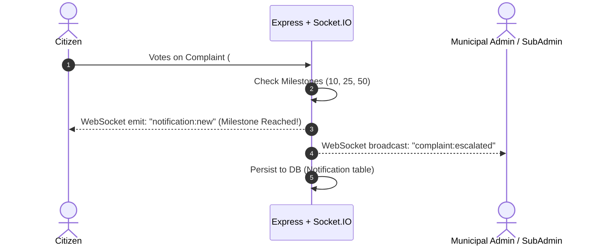

# 📘 CitiFix — Comprehensive New Features & Architecture Report

## 🌟 Executive Summary

**CitiFix** is an enterprise-grade civic technology platform that bridges the gap between citizens and municipal authorities. Recent engineering sprints have expanded CitiFix from a simple complaint portal into an end-to-end municipal management ecosystem featuring:

1. **Two-Factor Authentication (2FA / TOTP)** with Google Authenticator and emergency backup recovery codes.
2. **Real-Time WebSocket Architecture & In-App Notification Hub** for instant milestone, status, and escalation alerts.
3. **Automated Multi-Channel Escalation Engine** publishing across X (Twitter), Telegram channels, and formal department dispatch emails.
4. **4-Tier Hierarchical Governance & SubAdmin Operations** with SLA tracking, extension approvals, and internal blocker resolution.
5. **Project Bidding & Procurement Marketplace** allowing competitive quoting and single-click contract awarding.
6. **Resolution Integrity & Citizen Challenge System** requiring photo evidence and enabling dispute workflows.
7. **Real-Time Analytics Dashboard & Interactive GIS Heatmap** displaying city-wide problem density and SLA compliance.

---

## 1. 🔐 Two-Factor Authentication (2FA) & Account Security

### What It Does
Protects user accounts (especially municipal SubAdmins, Admins, and SuperAdmins) by enforcing Time-based One-Time Password (**TOTP**) verification during login and profile management.

### Key Capabilities
* **Standard TOTP Algorithm (RFC 6238)**: Integrates with Google Authenticator, Microsoft Authenticator, and Authy.
* **QR Code & Base32 Manual Key**: Instantly renders visual QR codes for scanning alongside base32 secrets for manual input.
* **Cryptographic Backup Recovery Codes**: Issues 8 one-time cryptographic backup codes for emergency login without a phone.
* **Two-Step Authentication Handshake**:
  1. Primary login with phone/OTP issues a restricted 5-minute `tempToken` (`purpose: "2fa"`).
  2. The client presents the `tempToken` + 6-digit TOTP code to `/api/auth/2fa/verify-login` to receive the full session JWT.
* **Security Settings Dashboard**: Dedicated interface at `/settings/security` to view status, enable/disable 2FA, and regenerate recovery codes.

### Relevant Source Files
* Backend: [`backend/routes/auth.js`](file:///c:/Users/ANIKET/Downloads/project_Aryya/project_arya/backend/routes/auth.js)
* Frontend Settings: [`frontend/src/pages/SecuritySettings.jsx`](file:///c:/Users/ANIKET/Downloads/project_Aryya/project_arya/frontend/src/pages/SecuritySettings.jsx)
* Setup Component: [`frontend/src/components/TwoFactorSetup.jsx`](file:///c:/Users/ANIKET/Downloads/project_Aryya/project_arya/frontend/src/components/TwoFactorSetup.jsx)
* Login Verifier: [`frontend/src/components/TwoFactorVerify.jsx`](file:///c:/Users/ANIKET/Downloads/project_Aryya/project_arya/frontend/src/components/TwoFactorVerify.jsx)

---

## 2. ⚡ Real-Time WebSockets & In-App Notification Center

### What It Does
Replaces polling with persistent bi-directional WebSocket connections powered by **Socket.IO**, giving users and municipal officers immediate updates when issues are upvoted, assigned, escalated, or resolved.



### Key Capabilities
* **Persistent In-App Notification Dropdown**: Bell icon in the navigation bar displaying live unread counts, categorized badges, and relative timestamps.
* **Role-Based & Direct User Targeting**:
  * Emits directly to individual user sockets (e.g. notifying the complaint owner of upvotes).
  * Broadcasts role-specific alerts (`ADMIN`, `SUPERADMIN`, `SUBADMIN`).
* **Supported Notification Events**:
  * `COMPLAINT_CREATED`: Alerts admins to newly filed issues.
  * `COMPLAINT_VOTED`: Alerts the original citizen when their issue receives votes.
  * `VOTE_MILESTONE`: Celebrates milestones at **10, 25, and 50 votes**.
  * `COMPLAINT_ESCALATED`: Notifies stakeholders when an issue crosses the escalation threshold.
  * `STATUS_CHANGED`: Live updates when status shifts (`ASSIGNED`, `RESOLVED`, `ON HOLD`).
  * `SLA_BREACH`: High-priority alert when a department exceeds SLA limits.
  * `RESOLUTION_CHALLENGED`: Notifies admins that a citizen disputed a resolution.

### Relevant Source Files
* WebSocket Hub: [`backend/services/socketManager.js`](file:///c:/Users/ANIKET/Downloads/project_Aryya/project_arya/backend/services/socketManager.js)
* Notification Logic: [`backend/services/notificationService.js`](file:///c:/Users/ANIKET/Downloads/project_Aryya/project_arya/backend/services/notificationService.js)
* Notification Center UI: [`frontend/src/components/NotificationCenter.jsx`](file:///c:/Users/ANIKET/Downloads/project_Aryya/project_arya/frontend/src/components/NotificationCenter.jsx)
* Socket Context: [`frontend/src/contexts/SocketContext.jsx`](file:///c:/Users/ANIKET/Downloads/project_Aryya/project_arya/frontend/src/contexts/SocketContext.jsx)

---

## 3. 🚨 Multi-Channel Automated Escalation Engine

### What It Does
When civic issues gain strong public support (50+ community votes) or linger past SLA deadlines, CitiFix automatically triggers multi-platform escalations to ensure public visibility and administrative accountability.

### Three Escalation Channels
1. **X (Twitter) Auto-Posting**:
   * Uses `twitter-api-v2` to publish structured tweets containing issue description, street address, category, vote count, and dynamic hashtags (`#CitiFix`, `#Roads`, `#Location`).
2. **Telegram Broadcasts**:
   * Posts formatted HTML messages with attached complaint photographs directly to official Telegram grievance channels.
3. **Formal Government Email Dispatch**:
   * Generates formatted official dispatch letters via SMTP sent to department-specific inboxes (*Roads, Water, Waste, Electricity, Parks, Traffic*). Includes Google Maps coordinates, complaint photos, and SLA deadlines.

### Background Cron Scheduler
* Runs background sweeps every hour (`escalationScheduler.js`) to catch pending escalations and detect SLA breaches across assigned tasks.

### Relevant Source Files
* X Service: [`backend/services/xEscalationService.js`](file:///c:/Users/ANIKET/Downloads/project_Aryya/project_arya/backend/services/xEscalationService.js)
* Telegram Service: [`backend/services/telegramEscalationService.js`](file:///c:/Users/ANIKET/Downloads/project_Aryya/project_arya/backend/services/telegramEscalationService.js)
* Email Service: [`backend/services/emailService.js`](file:///c:/Users/ANIKET/Downloads/project_Aryya/project_arya/backend/services/emailService.js)
* Cron Jobs: [`backend/jobs/escalationScheduler.js`](file:///c:/Users/ANIKET/Downloads/project_Aryya/project_arya/backend/jobs/escalationScheduler.js)

---

## 4. 👥 4-Tier Hierarchical Governance & SubAdmin Operations

### What It Does
Establishes a structured operational pipeline separating administrative authority from field operations.

```
┌────────────────────────────────────────────────────────┐
│                   SUPERADMIN                           │
│  - System configurations & Department SLA limits       │
│  - Review time extension requests                      │
│  - Assign complaints, budgets & tender project bids    │
└───────────────────────────┬────────────────────────────┘
                            │
┌───────────────────────────▼────────────────────────────┐
│                    SUBADMIN                            │
│  - Assigned to specific Department (Roads, Water, etc.) │
│  - Manages task board with live SLA countdown timers   │
│  - Submits bids, extension requests, & blocker issues  │
│  - Uploads photo evidence for resolution               │
└───────────────────────────┬────────────────────────────┘
                            │
┌───────────────────────────▼────────────────────────────┐
│                    CITIZEN                             │
│  - Report issues, upvote, & view interactive map       │
│  - Earn reward points upon verified resolution         │
│  - Challenge false or inadequate resolutions           │
└────────────────────────────────────────────────────────┘
```

### SuperAdmin Management Panel (`/superadmin`)
* **Department SLA Configurations**: Dynamically set standard resolution timeframes (e.g. Water: 3 days, Roads: 7 days, Electricity: 2 days).
* **Workload & SubAdmin Assignment**: Assign complaints directly with project budgets, warranty terms, and deadlines.
* **Extension Request Governance**: Review, approve, or reject timeline extension requests submitted by SubAdmins.
* **Performance Analytics**: Track average resolution hours and breach rates per SubAdmin.

### SubAdmin Field Dashboard (`/subadmin`)
* **Task Board & Countdown Timers**: Live visual countdown to SLA deadlines.
* **Time Extension Requests**: Submit formal requests with written justifications when delays occur.
* **Blocker / "Raised Issue" Flagging**: Put complaints on hold when unexpected dependencies arise (e.g. gas line blocking road repair).

### Relevant Source Files
* SuperAdmin Backend: [`backend/routes/superadmin.js`](file:///c:/Users/ANIKET/Downloads/project_Aryya/project_arya/backend/routes/superadmin.js)
* SubAdmin Backend: [`backend/routes/subadmin.js`](file:///c:/Users/ANIKET/Downloads/project_Aryya/project_arya/backend/routes/subadmin.js)
* SuperAdmin UI: [`frontend/src/pages/SuperAdminPanel.jsx`](file:///c:/Users/ANIKET/Downloads/project_Aryya/project_arya/frontend/src/pages/SuperAdminPanel.jsx)
* SubAdmin UI: [`frontend/src/pages/SubAdminDashboard.jsx`](file:///c:/Users/ANIKET/Downloads/project_Aryya/project_arya/frontend/src/pages/SubAdminDashboard.jsx)

---

## 5. 🏷️ Project Bidding & Contractor Procurement

### What It Does
Provides a competitive tendering system for larger municipal projects that require external contractor bids or cross-department budget allocations.

### Workflow
1. **Bid Publication**: SuperAdmin creates a tender linked to a complaint, defining scope, estimated budget ceiling, and submission deadline.
2. **Proposal Submission**: Department SubAdmins submit competitive proposals detailing:
   * Quoted budget
   * Proposed duration in days
   * Estimated team size
   * Technical execution approach
3. **One-Click Awarding**: SuperAdmin compares proposals side-by-side. Awarding a proposal automatically:
   * Marks the bid as `AWARDED`.
   * Rejects competing proposals.
   * Auto-assigns the winning SubAdmin to the complaint with the agreed budget and SLA deadline.

### Relevant Source Files
* Bids API: [`backend/routes/bids.js`](file:///c:/Users/ANIKET/Downloads/project_Aryya/project_arya/backend/routes/bids.js)
* Database Schema: `ProjectBid` and `BidProposal` models in [`backend/prisma/schema.prisma`](file:///c:/Users/ANIKET/Downloads/project_Aryya/project_arya/backend/prisma/schema.prisma#L166-L200)

---

## 6. 🛡️ Resolution Integrity & Citizen Dispute Mechanism

### What It Does
Prevents false or low-quality resolutions by enforcing photo verification and giving citizens the power to dispute incomplete repairs.

### Key Mechanics
1. **Mandatory Photo Proof**: SubAdmins must submit photographic evidence (`resolutionImageUrl`) when marking an issue resolved (`/api/complaints/:id/resolve-with-proof`).
2. **Citizen Reward Points**: Upon successful resolution, the citizen who filed the report receives **10 civic reward points**.
3. **Resolution Challenge (Dispute)**:
   * If the issue was not properly resolved, the original reporter can submit a **Challenge Resolution** with a dispute note (`/api/complaints/:id/challenge-resolution`).
   * Challenging automatically resets the status to `OPEN`, marks `resolutionChallenged: true`, and notifies municipal admins for review.

### Relevant Source Files
* Endpoints: [`backend/routes/complaints.js`](file:///c:/Users/ANIKET/Downloads/project_Aryya/project_arya/backend/routes/complaints.js#L358-L442)
* Client UI: [`frontend/src/pages/MyComplaints.jsx`](file:///c:/Users/ANIKET/Downloads/project_Aryya/project_arya/frontend/src/pages/MyComplaints.jsx)

---

## 7. 📊 Real-Time Analytics Dashboard & Interactive Heatmap

### What It Does
Provides city administrators and citizens with high-level visibility into municipal operations and geographical problem clustering.

### Key Capabilities
* **Live KPI Counters**: Real-time counter metrics with smooth number tweening (Total Complaints, In Progress, Resolved, Escalations, SLA Compliance Rate).
* **Interactive Recharts Charts**:
  * 7-day influx vs. resolution comparison.
  * Category breakdown (Roads, Water, Waste, Electricity, etc.).
  * Status distribution pie charts.
* **Real-Time Live Activity Feed**: Displays recently logged actions, upvotes, and escalations as they occur via WebSockets.
* **City-Wide GIS Heatmap (`/map`)**: Leaflet-powered visual map plotting complaint density, status colors, and coordinates across the city.

### Relevant Source Files
* Analytics Endpoint: [`backend/routes/dashboard.js`](file:///c:/Users/ANIKET/Downloads/project_Aryya/project_arya/backend/routes/dashboard.js)
* Analytics Dashboard UI: [`frontend/src/pages/RealTimeDashboard.jsx`](file:///c:/Users/ANIKET/Downloads/project_Aryya/project_arya/frontend/src/pages/RealTimeDashboard.jsx)
* Heatmap UI: [`frontend/src/pages/CityHeatmap.jsx`](file:///c:/Users/ANIKET/Downloads/project_Aryya/project_arya/frontend/src/pages/CityHeatmap.jsx)

---

## 8. 🗺️ API Route Reference

| Category | Method | Endpoint | Description | Auth Required |
| :--- | :--- | :--- | :--- | :--- |
| **Auth** | `POST` | `/api/auth/request-otp` | Generate login/registration OTP | Public |
| **Auth** | `POST` | `/api/auth/login/verify` | Verify OTP & initiate 2FA check | Public |
| **2FA** | `POST` | `/api/auth/2fa/setup` | Generate TOTP secret & QR code | User |
| **2FA** | `POST` | `/api/auth/2fa/verify-setup` | Confirm initial TOTP verification | User |
| **2FA** | `POST` | `/api/auth/2fa/verify-login` | Verify TOTP/backup code during login | TempToken |
| **2FA** | `POST` | `/api/auth/2fa/disable` | Deactivate 2FA | User |
| **Notifications** | `GET` | `/api/notifications` | Fetch user notification list | User |
| **Notifications** | `PATCH` | `/api/notifications/:id/read` | Mark single notification as read | User |
| **Notifications** | `POST` | `/api/notifications/mark-all-read`| Mark all notifications as read | User |
| **Complaints** | `POST` | `/api/complaints/:id/vote` | Upvote & trigger auto-escalation check | User |
| **Complaints** | `POST` | `/api/complaints/:id/resolve-with-proof` | Upload photo proof to resolve complaint | SubAdmin/Admin |
| **Complaints** | `POST` | `/api/complaints/:id/challenge-resolution` | Dispute resolution and reopen complaint | Citizen Owner |
| **Complaints** | `GET` | `/api/complaints/heatmap` | Public map coordinates of all complaints | Public |
| **SuperAdmin** | `PATCH` | `/api/superadmin/users/:id/role`| Update user role and department | SuperAdmin |
| **SuperAdmin** | `POST` | `/api/superadmin/complaints/:id/assign`| Assign complaint to SubAdmin + SLA | SuperAdmin |
| **SuperAdmin** | `PUT` | `/api/superadmin/sla/:dept` | Update department SLA resolution days | SuperAdmin |
| **SuperAdmin** | `PATCH` | `/api/superadmin/extension-requests/:id` | Approve/Reject extension request | SuperAdmin |
| **SubAdmin** | `GET` | `/api/subadmin/complaints` | Fetch assigned complaints | SubAdmin |
| **SubAdmin** | `POST` | `/api/subadmin/complaints/:id/request-extension`| Submit deadline extension request | SubAdmin |
| **SubAdmin** | `POST` | `/api/subadmin/complaints/:id/raise-issue` | Raise blocker and place on hold | SubAdmin |
| **Bids** | `POST` | `/api/bids` | SuperAdmin creates a project tender | SuperAdmin |
| **Bids** | `POST` | `/api/bids/:id/propose` | SubAdmin submits competitive quote | SubAdmin |
| **Bids** | `POST` | `/api/bids/:id/award/:proposalId` | SuperAdmin awards winning proposal | SuperAdmin |
| **Analytics** | `GET` | `/api/dashboard/analytics` | Fetch live KPI summary & 7-day trends | User |

---

## 9. 🚀 Demo & Test Accounts

For testing all tiers of functionality, the system includes built-in demo credentials (OTP: `123456`):

| Role | Phone Number | Accessible Portals & Features |
| :--- | :--- | :--- |
| **SuperAdmin** | `+910000000001` | SuperAdmin Panel (`/superadmin`), SLA Management, Bids, Global Analytics |
| **SubAdmin** | `+910000000002` | SubAdmin Operations (`/subadmin`), Task Countdown, Bidding, Proof Resolution |
| **Citizen** | `+910000000003` | Citizen Dashboard (`/dashboard`), Report (`/report`), My Complaints, Upvoting |
